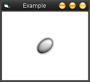



## \_ Hover Picture Button Control With 3 States \(Mouse Over, Mouse Leave, Mouse Down\) \_

### Description

A custom control I made for a program to save time. Its a custom button using your own pictures. Accurately detect when mouse enters, leaves, or is pressed. Please vote/leave comments :)
 
### More Info
 

             |
---                |---
**Submitted On**   |2004-05-14 22:26:36
**By**             |[KRYO\_11](https://github.com/Planet-Source-Code/PSCIndex/blob/master/ByAuthor/kryo-11.md)
**Level**          |Intermediate
**User Rating**    |4.6 (73 globes from 16 users)
**Compatibility**  |VB 5\.0, VB 6\.0
**Category**       |[Custom Controls/ Forms/  Menus](https://github.com/Planet-Source-Code/PSCIndex/blob/master/ByCategory/custom-controls-forms-menus__1-4.md)
**World**          |[Visual Basic](https://github.com/Planet-Source-Code/PSCIndex/blob/master/ByWorld/visual-basic.md)
**Archive File**   |[\_\_Hover\_Pi1745765152004\.zip](https://github.com/Planet-Source-Code/kryo-11-hover-picture-button-control-with-3-states-mouse-over-mouse-leave-mouse-down__1-53803/archive/master.zip)

